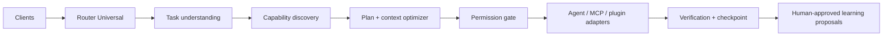

# Router Universal

**The local-first orchestration brain for Nova and any AI client.**

Router Universal turns a natural-language request into a safe, inspectable execution plan across
agents, skills, MCP servers, plugins, and tools. It is framework-agnostic, permission-aware,
context-efficient, resumable, and designed to improve through human-approved proposals rather than
silent self-modification.

## What exists today

- A typed routing pipeline: understand → discover → select → plan → optimize → authorize → execute → verify → learn.
- Validated capability manifests for agents, skills, MCP servers, plugins, and tools.
- Strict, balanced, and developer permission modes with per-capability overrides.
- Dry-run previews that explain why each capability was selected.
- Local HTTP and stdio adapters, with remote endpoints disabled by default.
- Context deduplication and token-budget enforcement.
- Checkpointed runs, structured events, privacy-safe logs, and improvement proposals.
- A Fastify API, CLI, integration SDK, example capability, tests, CI, and AI-coder milestone prompts.

## Quick start

```bash
npm install
npm run validate
npm run nova -- preview "Create a React project and verify the build"
npm run nova -- run "Inspect this repository" --dry-run
npm run dev:api
```

The API binds to `127.0.0.1:4317` by default. Copy `.env.example` to `.env` when you need custom
settings. Set `NOVA_API_TOKEN` before exposing the service beyond a private local environment.

## Core idea

Clients such as OpenClaw, Hermes, a VS Code extension, a tray app, or a voice interface call one
router. The router inventories available capabilities, chooses the smallest trustworthy set, creates
a DAG-like plan, asks for permissions when required, dispatches work through adapters, verifies the
result, and records only privacy-safe metadata.



## Repository map

- `packages/contracts` — schemas and stable integration contracts.
- `packages/core` — understanding, discovery, policy, planning, optimization, execution, and state.
- `packages/sdk` — helpers and adapters for integrating capabilities.
- `apps/api` — local HTTP service.
- `apps/cli` — preview, run, validate, and capability commands.
- `config/capabilities` — example capability manifests.
- `docs` — architecture, security, roadmap, and decisions.
- `prompts` — master AI engineering rules and milestone prompts.
- `tests` — unit and integration coverage.

Start with [`START_HERE.md`](START_HERE.md). The current implementation status is tracked in
[`docs/project-state.md`](docs/project-state.md).

## Non-goals

Router Universal is not a model, not an autonomous root shell, and not a replacement for specialist
coding agents. It is the governed orchestration layer that lets those systems work together.

## License

MIT.
