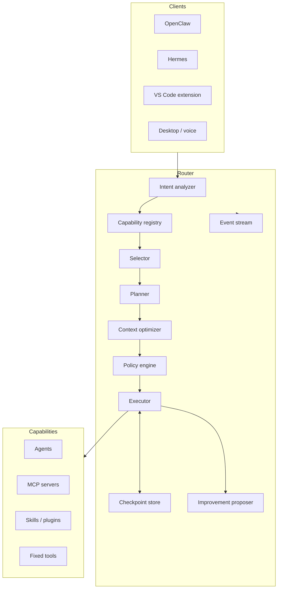

# Architecture

## Boundaries

Router Universal contains a pure routing core, stable contracts, integration adapters, and thin
clients. It does not contain vendor-specific reasoning, UI automation, or unrestricted shell logic.

## Stable contracts

`packages/contracts` defines task requests, understanding results, capability manifests, route
selections, plans, permission decisions, adapter execution, run state, events, and improvement
proposals. Integrations must depend on contracts rather than core internals.

## Dependency rule

Contracts know nothing about implementations. Core depends on contracts. SDK depends on contracts.
Applications compose core and SDK. Adapters never import application code.

## Extension model

A capability is installed by adding a manifest and an adapter. Manifests describe what a capability
can do, its trust level, permissions, cost hints, and transport. Adapters implement execution. This
keeps model selection, OpenHands, OpenCode, Hermes, MCP, and future systems replaceable.

## Runtime safety

The default runtime only accepts local HTTP capabilities, fixed stdio commands without a shell, and
in-memory adapters. Remote HTTP is disabled unless explicitly enabled. Permission policy is evaluated
for every step, not once per session.
